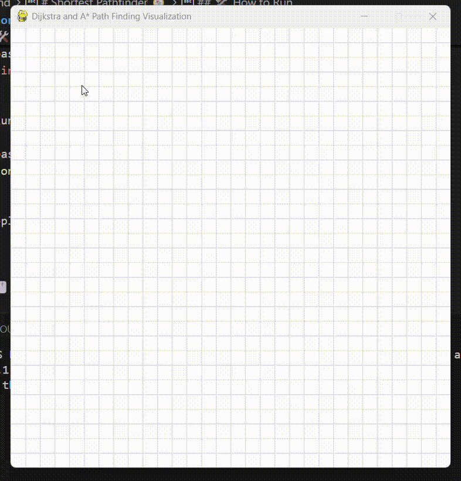

## 🎥 Preview



# Shortest Pathfinder 🧭

A Pygame-based visualization tool for **Dijkstra's Algorithm** and **A* (A-Star) Algorithm** to find the shortest path in a 2D grid. Ideal for understanding how pathfinding algorithms work visually and interactively.

---

## 🚀 Features

- Interactive grid to set **start**, **end**, and **barrier** nodes
- Visual implementation of:
  - 🔵 A* Search Algorithm (press `A`)
  - 🟡 Dijkstra's Algorithm (press `D`)
- Clear grid with `C` key
- Realtime algorithm visualization with color-coded paths

---

## 🎨 Color Legend

| Color        | Meaning           |
|--------------|--------------------|
| 🟧 Orange     | Start Node         |
| 🟪 Purple     | End Node           |
| ⬛ Black      | Barrier Node       |
| 🟥 Red        | Already Visited    |
| 🟩 Green      | In Queue (to Visit)|
| 🔵 Blue       | Final Path         |
| ⬜ White      | Unvisited Node     |

---

## 🛠️ How to Run

1. Clone the repository:

```bash
git clone git@github.com:Abhiz2411/shortest-pathfinder.git
cd shortest-pathfinder
```

2. Install dependencies:

```bash
pip install pygame
```

3. Run the application:

```bash
python pathfinder.py
```

> Replace `pathfinder.py` with your script filename if it's different.

---

## 🖱️ Controls

- **Left Click**:
  - First click to set the **Start** point
  - Second click to set the **End** point
  - Further clicks to add **Barriers**
- **Right Click**: Remove a node (reset to white)
- **A Key**: Run **A\*** algorithm
- **D Key**: Run **Dijkstra’s** algorithm
- **C Key**: Clear the entire grid

---

## 📐 Algorithms

### A* (A-Star) Search

Uses both the actual cost (`g(n)`) and a heuristic estimate (`h(n)`) to find the shortest path faster than Dijkstra in many cases.

### Dijkstra’s Algorithm

Guarantees the shortest path without a heuristic. Slower but always accurate.

---

## 📸 Screenshot

> Add a screenshot here of the visualization in action!

---

## 🧠 Concepts Used

- Pygame graphics and event handling
- Priority Queues (`heapq`/`queue.PriorityQueue`)
- Grid-based pathfinding
- Heuristic functions (Manhattan Distance)

---

## 🤝 Contribution

Feel free to fork and contribute. Open a pull request if you add any improvements or new algorithms!

---

## 📄 License

This project is open-source and available under the [MIT License](LICENSE).

---

Made with ❤️ using Python and Pygame.